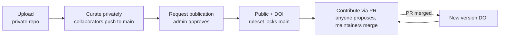

Every NEMAR dataset lives in two phases, and the collaboration model is different in each:

- **Private (draft).** The repository is closed. You add **collaborators**, who get push access and edit the data directly. This is where curation happens.
- **Public (published).** The repository is open and has a DOI. Anyone can contribute through **pull requests**; nobody pushes to `main` directly. Collaborators are no longer needed to *contribute*, but they stay on as maintainers who review and merge.

The short version: **private data uses collaborators, public data uses pull requests.**



## 1. Upload (private by default)

A new dataset is created **private**: a private GitHub repo, a private S3 prefix, and you as owner. Sandbox training is a one-time prerequisite.

```bash
nemar sandbox                    # one-time, required before your first upload
nemar dataset validate ./study   # optional; upload validates too
nemar dataset upload ./study
```

See [Uploading Datasets](/cli/guides/uploading/) for the full walkthrough.

## 2. Work privately with collaborators

While the dataset is private, `main` is open to push, so collaborators iterate directly without pull requests.

### Add a collaborator

```bash
nemar dataset invite <username> <dataset-id>
```

Only the **owner or an admin** can invite. The invitee must be an **approved NEMAR user with a linked GitHub account**. They receive:

- **push** access to the GitHub repo, and
- **upload** access to the dataset's S3 storage.

### Let people ask for access

A user can request access to a private dataset; the owner approves or denies.

```bash
# Requester
nemar dataset request-access <dataset-id>

# Owner or admin
nemar dataset access list <dataset-id>                # pending requests
nemar dataset access approve <username> <dataset-id>  # grants push + upload
nemar dataset access deny <username> <dataset-id>
```

Approving grants exactly the same access as an invite. A denied user may request again later.

### Contribute to a private dataset

```bash
nemar dataset clone <dataset-id>
cd <dataset-id>
nemar dataset get .              # fetch the data files (needs auth on a private dataset)

# make changes, then:
nemar dataset save -m "Add subjects 10-15"
nemar dataset push               # pushes commits + data straight to main
```

List who has access at any time with `nemar dataset collaborators <dataset-id>`. To remove someone, contact an admin.

## 3. Publish

Publication is a request the owner submits and an admin approves. It cannot be self-served.

```bash
nemar dataset publish request <dataset-id>
nemar dataset publish status <dataset-id>
```

The request is **blocked** until BIDS validation passes, and (for original submissions) until the dataset meets the [submission standards](/policies/submission-standards/). On approval, an admin runs an automated pipeline that makes the repo public, opens S3 read access, and mints a permanent DOI. See [Publishing Datasets](/cli/guides/publishing/) for every step.

## 4. Work on public data via pull request

Once public, a branch ruleset locks `main`: **direct pushes and force-pushes are blocked for everyone**, and every change must go through a PR that passes BIDS validation and the version check. This is why collaborators are no longer required to contribute, anyone can propose a change.

**Anyone** can contribute by forking the repo and opening a pull request.

**The owner and collaborators** use the CLI wrappers, which push to a branch and open the PR for you:

```bash
nemar dataset update <dataset-id> -m "Fix channel locations"   # data or metadata change
nemar dataset release <dataset-id> --type minor                # version bump only
```

Merging a PR tags a new release and mints a **version DOI** automatically. See [Versioning](/cli/guides/versioning/) for the release workflow.

### What collaborators keep after publishing

Publishing does **not** remove collaborators. They can no longer push to `main` directly (nobody can), but because they hold write access they can **merge pull requests** once checks are green and cut new versions. Outside contributors can only propose changes; collaborators and the owner are the maintainers who review, merge, and release.

## Who can do what

| Action | Owner | Collaborator | Anyone (public repo) |
|---|---|---|---|
| Push directly to `main` (private) | ✅ | ✅ | — repo is closed |
| Push directly to `main` (public) | ❌ ruleset | ❌ ruleset | ❌ ruleset |
| Open a pull request (public) | ✅ | ✅ | ✅ (via fork) |
| Merge a pull request (public) | ✅ | ✅ | ❌ |
| Invite collaborators / review access | ✅ | ❌ | ❌ |
| Request publication | ✅ | ❌ | ❌ |

## Prerequisites & gotchas

- **Sandbox training** is required once before your first upload.
- **Invitees must be approved NEMAR users with a linked GitHub account**, or the grant is refused.
- **`request-access` on a *public* dataset grants nothing** — the repo is already open, so fork it and open a PR (or ask the owner for an invite if you want merge rights).
- **Publication is gated:** BIDS validation must be green, and original submissions must meet the submission standards.

## See also

- [Uploading Datasets](/cli/guides/uploading/)
- [Publishing Datasets](/cli/guides/publishing/)
- [Versioning](/cli/guides/versioning/)
- [Dataset command reference](/cli/commands/dataset/)
