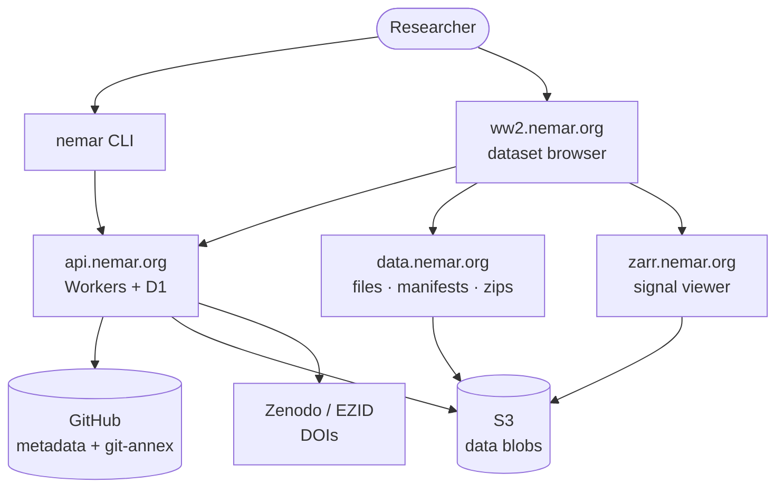
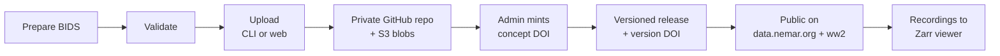

NEMAR is not a single application; it is a set of cooperating systems. This page is the map.
The command-line interface (CLI) is where most users start, but it is one client of a larger
platform, and more parts are joining over time.

## How the pieces connect

## Surfaces

| Part | URL | Role | Docs |
| --- | --- | --- | --- |
| **CLI** | `nemar` | Upload, validate, version, download, and manage datasets from the terminal | [CLI](/cli/) |
| **Backend API** | `api.nemar.org` | Auth, dataset lifecycle, admin, publication, DOIs (Cloudflare Workers + D1) | [Platform API](/platform/api/) |
| **Data plane** | `data.nemar.org` | Public dataset files, version manifests, `records.json`, archive zips | [Data API](/platform/data-api/) |
| **Dataset browser** | `ww2.nemar.org` | The current web browser for datasets (Astro) | external |
| **Signal viewer** | `zarr.nemar.org` | In-browser EEG/EMG viewer streaming per-recording Zarr | external |
| **Legacy site** | `nemar.org` | Original PHP dataexplorer; being replaced by `ww2.nemar.org` | external |

## How a dataset flows through NEMAR

1. A researcher prepares a BIDS dataset and validates it with the **CLI**.
2. The CLI registers the dataset through the **backend API**, which creates a private GitHub
   repository (metadata + git-annex pointers) and provisions S3 storage for the data blobs.
3. Data files upload to S3; metadata is versioned in GitHub.
4. An admin mints a concept DOI; the researcher cuts versioned releases (each with its own DOI).
5. On publication the dataset becomes public on the **data plane** (`data.nemar.org`) and is
   surfaced in the **browser** (`ww2.nemar.org`); recordings are converted for the **viewer**.

## Where to go next

- New to NEMAR? Start with the [CLI installation guide](/cli/getting-started/installation/).
- Building against the API or pulling data programmatically? See [Platform & APIs](/platform/).
- A NEMAR administrator? See the [admin documentation](/admin/commands/) (access-gated).

:::note
This documentation site covers the whole ecosystem. As new systems come online (additional
services and tooling), they get their own sections here rather than being folded into the CLI docs.
:::
